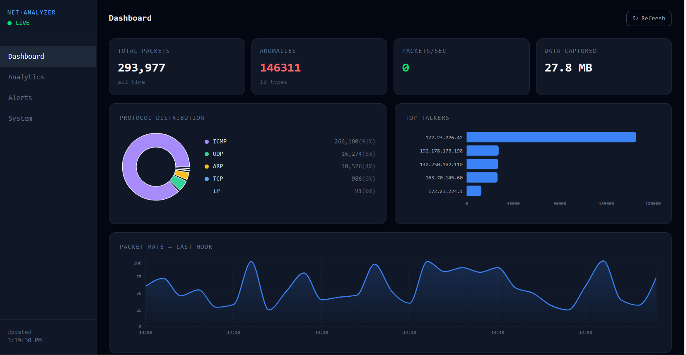
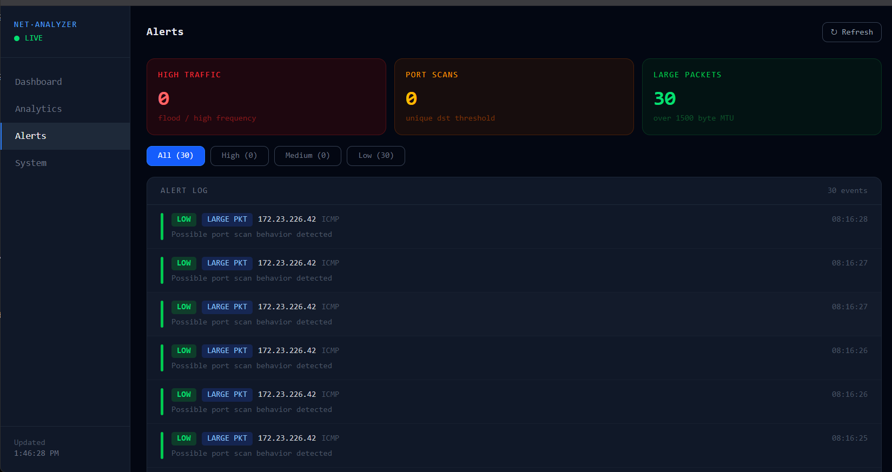
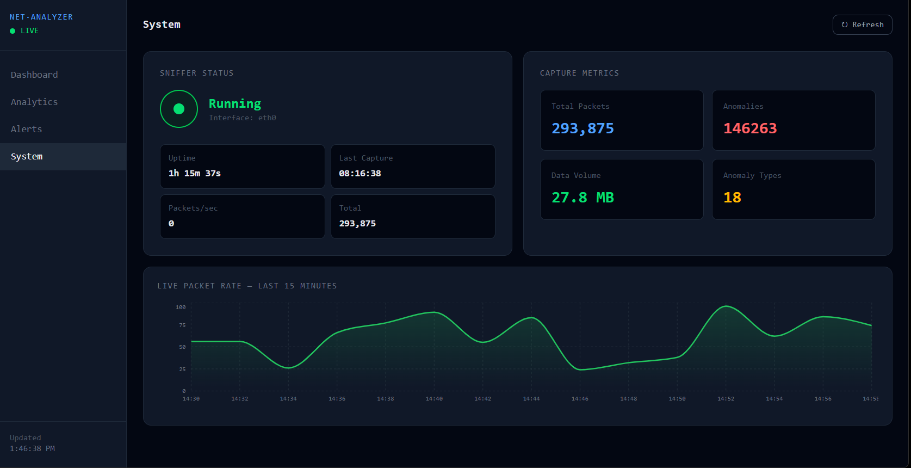

# Network Traffic Analyzer

A full-stack network monitoring tool that captures and analyzes live
TCP/IP, UDP, ARP, and ICMP traffic in real time — with anomaly detection,
a React dashboard, and automated reporting.



## Tech stack

| Layer     | Technology                          |
|-----------|-------------------------------------|
| Capture   | Python, Scapy                       |
| Backend   | Flask, Flask-CORS                   |
| Database  | MySQL                               |
| Frontend  | React 18, Vite, Tailwind CSS        |
| Charts    | Recharts                            |
| Automation| Bash, cron                          |

## Features

- Live packet capture — classifies TCP, UDP, ARP, ICMP in real time
- 3 anomaly detection types:
  - High-frequency source flooding
  - Port scan pattern (5+ unique destinations)
  - Oversized packet detection (> 1500 bytes MTU)
- 4-page React dashboard with auto-refresh every 5 seconds
- REST API (Flask) serving live MySQL data
- Automated capture cycles and reports via Bash + cron

## Stats from a real capture session

- 300,000 packets analyzed over 8 hours
- 14000 anomaly events detected across 3 types
- 184.2 MB of traffic logged to MySQL

## Project structure

```
network-analyzer/
├── sniffer.py          # packet capture + anomaly detection
├── database.py         # MySQL helpers
├── api.py              # Flask REST API (5 endpoints)
├── automate.sh         # cron shell script
├── config.example.py   # copy to config.py and add your password
├── frontend/
│   └── src/
│       ├── App.jsx
│       └── pages/
│           ├── Dashboard.jsx
│           ├── Analytics.jsx
│           ├── Alerts.jsx
│           └── SystemStatus.jsx
└── README.md
```

## Screenshots

### Dashboard


### Analytics


### Alerts


### System Status

## Setup

### 1. Clone the repo
```bash
git clone https://github.com/Shobha000/network-traffic-analyzer.git
cd network-traffic-analyzer
```

### 2. Install Python dependencies
```bash
pip3 install scapy mysql-connector-python flask flask-cors rich
```

### 3. Set up MySQL
```bash
sudo service mysql start
mysql -u root -p < schema.sql
```

### 4. Configure database
```bash
cp config.example.py config.py
nano config.py   # add your MySQL password
```

### 5. Run the sniffer
```bash
sudo python3 sniffer.py
```

### 6. Run the API
```bash
python3 api.py
```

### 7. Run the frontend
```bash
cd frontend
npm install
npm run dev
# open http://localhost:5173
```

## API endpoints

| Endpoint                  | Returns                        |
|---------------------------|----------------| GET /api/stats            | total packets, anomalies, uptime|
| GET /api/protocols        | protocol breakdown counts      |
| GET /api/talkers          | top 8 source IPs by packet count|
| GET /api/anomalies        | last 30 anomalies with severity |
| GET /api/traffic-over-time| packets per minute (last hour) |
| GET /api/packet-sizes     | packet size distribution       |

## Anomaly detection

| Type           | Trigger                              | Severity |
|----------------|--------------------------------------|----------|
| High frequency | Same IP sends 10+ packets            | High     |
| Port scan      | Same IP contacts 5+ unique IPs       | Medium   |
| Large packet   | Packet size exceeds 1500 bytes (MTU) | Low      |

## What I learned

- TCP/IP, ARP, ICMP packet structure and how they differ
- Raw socket programming with Python (requires root/CAP_NET_RAW)
- MySQL indexing strategies for time-series query performance
- Building REST APIs with Flask and connecting to React via proxy
- Linux automation with Bash scripting and cron scheduling

## License

MIT
